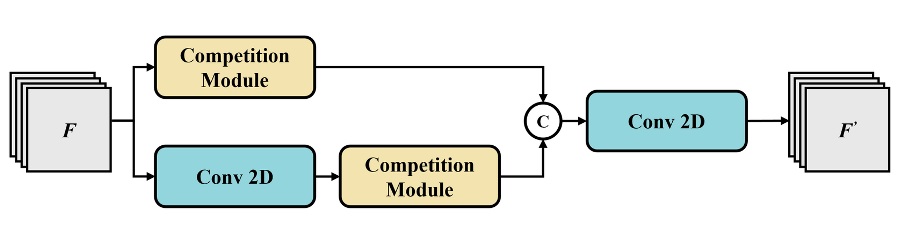

# LViT-CB : A Lightweight Vision Transformer with Competitive Blocks for Finger Vein Recognition
<div align="center">
  
  This is the official implementation of LViT-CB: A Lightweight Vision Transformer with Competitive Blocks for Finger Vein Recognition. LViT-CB is designed to be fast and efficient, while maintaining high biometric recognition quality.  

  [[`Paper`](https://ieeexplore.ieee.org/document/11130997)]
  
  <br>
  Fig 1. Overall Architecture of LViT-CB model.  
  
  <br>
  <br>
  Fig 2. Architecture Overview of the Competition Block (Top) and Competition Module (Bottom).  

</div>

## Environments  
```
conda env create -f environment.yaml
```
```
conda activate fingervein
```

## Prepare dataset for Training and Testing
> Get a .pkl file contain data's path 
```
python 000_make_Dataset.py
```  

## Training
> Start training the model 
```
python 001_train.py
```

## Testing 
> Start evaluating the model
```
python 002_test.py
```

## Model's structure and details
```
python model_detail.py
```

## Citation： 
```
@INPROCEEDINGS{11130997,
  author={Chen, Chi-An and Chien, Tzu-Hung and Ke, Liang-Ying and Hsia, Chih-Hsien},
  booktitle={2025 Seventh International Symposium on Computer, Consumer and Control (IS3C)}, 
  title={A Lightweight Vision Transformer with Competitive Blocks for Finger Vein Recognition}, 
  year={2025},
  volume={},
  number={},
  pages={1-4},
  keywords={Computer vision;Computational modeling;Biological system modeling;Fingers;Computer architecture;Transformers;Feature extraction;Computational efficiency;Security;Computational complexity;Computer Vision;Vision Transformer;Biometrics;Finger Vein},
  doi={10.1109/IS3C65361.2025.11130997}}
```


