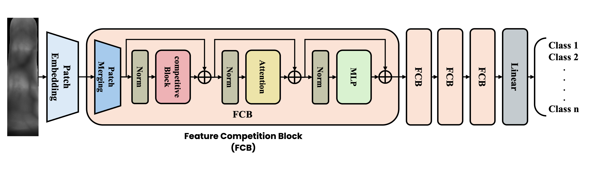

# LViT-CB : A Lightweight Vision Transformer with Competitive Blocks
<div align="center">

  [[`Paper`](assets/paper.png)]
  
  This is the official PyTorch implementation of LViT-CB: a lightweight Vision Transformer with Competitive Blocks. LViT-CB is designed to be fast and efficient, while maintaining high biometric recognition quality.  
  
  <br>
  Fig 1. Overall Architecture of LViT-CB model.
  <br>
  Fig 2. Architecture Overview of the Competition Block (Top) and Competition Module (Bottom).

</div>

## Environments  
```
conda env create -f environment.yaml
```
```
conda activate fingervein
```

## Prepare dataset for Training and Testing
Get a .pkl file contain data's path 
```
python 000_make_Dataset.py
```  

## Training
Start training the model 
```
python 001_train.py
```

## Testing 
Start evaluating the model
```
python 002_test.py
```

## Model's structure and details
```
python model_detail.py
```
## Experiment Results  
```
==================================
FV-USM
Accuracy               : 99.93
EER (Equal Error Rate) :  0.07
----------------------------------
PLUSVein-FV3 [LED]
Accuracy               : 99.17
EER (Equal Error Rate) :  1.19
----------------------------------
PLUSVein-FV3 [Laser]
Accuracy               : 98.92
EER (Equal Error Rate) :  1.09
==================================
```  

# References： 
> * C.-H. Hsia, L.-Y. Ke, and S.-T. Chen, “Improved lightweight convolutional neural network for finger vein recognition system,” _Bioengineering_, vol. 10, no. 8, pp. 919, 2023.  
> [[GitHub]](https://github.com/liangying-Ke/ILCNN)
> * T.F. Zhang, et al., "Cas-vit: Convolutional additive self-attention vision transformers for efficient mobile applications," _ArXiv_ ,arXiv:2408.03703, 2024.  
> [[GitHub]](https://github.com/Tianfang-Zhang/CAS-ViT)
> * Z. Yang, et al., "Comprehensive Competition Mechanism in Palmprint Recognition," _IEEE Transactions on Information Forensics and Security_, vol. 18, pp. 5160-5170, 2023.  
>[[GitHub]](https://github.com/Zi-YuanYang/CCNet)

